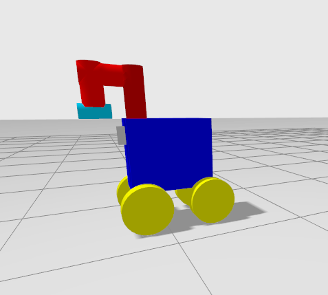
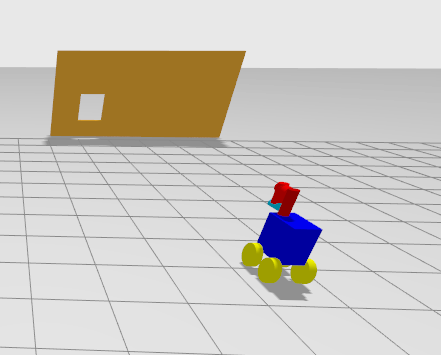
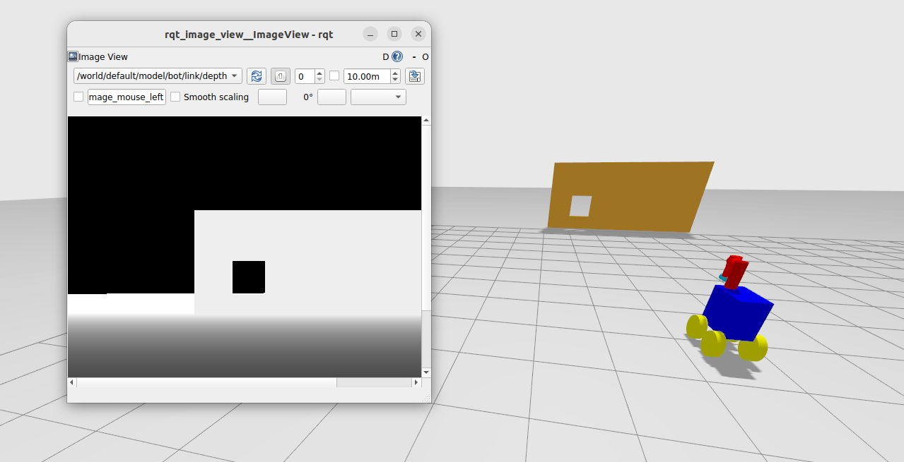
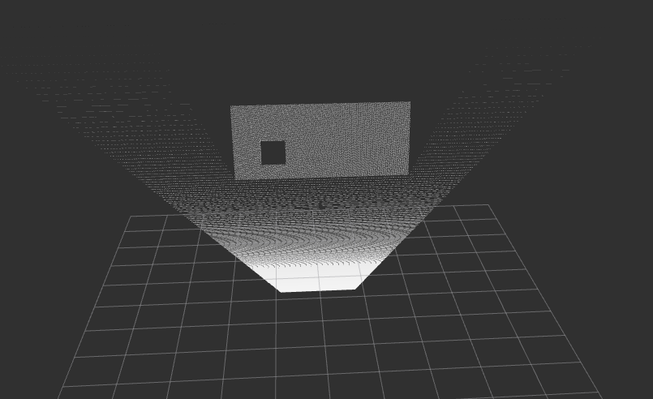
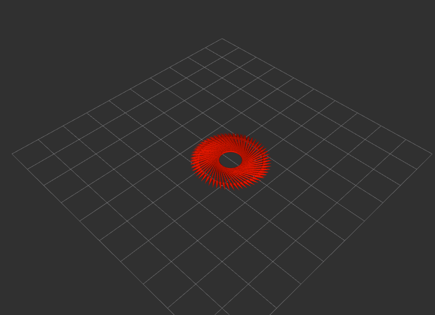

# IRoc URDF Model - Simulations in Gazebo And Rviz2
Download the **bot.sdf** which is the SDF (Simulation Description Format) file of IRoc Rover.

# Install Dependencies: 
Run -
```bash
sudo apt-get update
sudo apt-get install lsb-release wget gnupg
sudo wget https://packages.osrfoundation.org/gazebo.gpg -O /usr/share/keyrings/pkgs-osrf-archive-keyring.gpg
echo "deb [arch=$(dpkg --print-architecture) signed-by=/usr/share/keyrings/pkgs-osrf-archive-keyring.gpg] http://packages.osrfoundation.org/gazebo/ubuntu-stable $(lsb_release -cs) main" | sudo tee /etc/apt/sources.list.d/gazebo-stable.list > /dev/null
sudo apt-get update
sudo apt-get install ignition-fortress
sudo apt-get install ros-humble-rviz2
sudo apt-get install ros-humble-gazebo-plugins
sudo apt-get install ros-humble-gazebo-ros-pkgs
sudo apt-get install ros-humble-gazebo-msgs
sudo apt-get install ros-humble-tf2-ros ros-humble-tf2-tools
sudo apt-get install gazebo-ros-control
sudo apt-get install ros-humble-gazebo-ros-control
sudo apt-get install ros-humble-gazebo-ros-pkgs
sudo apt-get install ros-humble-ros-ign-bridge
```

# Simulation in Gazebo and Rviz2
For Gazebo, run -
```bash
ign gazebo bot.sdf
```

<div align="center">
    
</div>

<div align="center">
    
</div>

For Rviz2, in a seprate terminal run -
```bash
rviz2
```

To get list of ign topics (gazebo topics), run -
```
ign topic -l
```

While for ros2 topics, run -
```
ros2 topic list
```


# Access Informations from Plugins and Visualize in Rviz2

To access any topic, create a bridge from gz to ros2 by running command in the format- 
```bash
ros2 run ros_gz_bridge parameter_bridge /TOPIC@ROS_MSG@IGN_MSG
```
**NOTE** : For msg types refer here - [Bridge communication between ROS and Gazebo](https://github.com/gazebosim/ros_gz/blob/ros2/ros_gz_bridge/README.md#example-1a-ignition-transport-talker-and-ros-2-listener)

- For depth image (by depth camera) along with camera info (For Rviz2) run the following commands in seprate terminals..
  ```
  ros2 run ros_gz_bridge parameter_bridge /world/default/model/bot/link/depth/sensor/depth_camera/depth_image@sensor_msgs/msg/Image@gz.msgs.Image
  ros2 run ros_gz_bridge parameter_bridge /world/default/model/bot/link/depth/sensor/depth_camera/camera_info@sensor_msgs/msg/CameraInfo@gz.msgs.CameraInfo
  ```
- Visualize depth image using rqt pkg -
  ```
  ros2 run rqt_image_view rqt_image_view /world/default/model/bot/link/depth/sensor/depth_camera/depth_image
  ```
    
    
- Bridge for point cloud (by depth camera) -
  ```
  ros2 run ros_gz_bridge parameter_bridge /world/default/model/bot/link/depth/sensor/depth_camera/depth_image/points@sensor_msgs/msg/PointCloud2@gz.msgs.PointCloudPacked
  ```
  Change fixed frame in rviz2 to bot/depth/depth_camera to read pointcloud or depth image data.

  
  
- To get pathlines of bot, establish odometry bridge via -
    ```
    ros2 run ros_gz_bridge parameter_bridge /model/bot/odometry@nav_msgs/msg/Odometry@gz.msgs.Odometry
    ```
    Change fixed frame in rviz2 to bot/odom for odometry measurements.

# Controlling the Bot

We can contol the bot through arrow keys (use of `keypublisher` plugin) or can publish to the topic `/cmd_vel` by running command - 
```
ign topic -t "/cmd_vel" -m ignition.msgs.Twist -p "linear: {x: 0.2}, angular: {z: 0.5}"
```



To check for keyboard commands, run -
```
ign topic -e -t /keyboard/keypress
```

# Transformations

To apply transformation to send data from one frame to another one, run command in the format-

```
ros2 run tf2_ros static_transform_publisher --frame-id bot/depth/depth_camera --child-frame-id world
```

